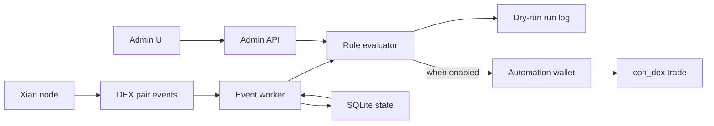

# xian-dex-automation

`xian-dex-automation` is the deterministic event-driven automation service
for the Xian DEX. It watches DEX pair events, evaluates explicit rules, and
optionally executes swaps from a dedicated automation wallet, with an
admin API and a built-in admin UI.

It is deliberately separate from neighbouring projects:

- `xian-dex-automation` — predictable, rule-driven execution.
- `xian-intentkit` — agent workflows where an AI model decides what to do.
- `xian-dex` (the DEX website) — the human trading and liquidity UI.

## Service Shape



## Quick Start

Set up a local environment:

```bash
cd xian-dex-automation
uv sync --extra dev
cp config.example.yaml config.yaml
export XIAN_DEX_AUTOMATION_ADMIN_TOKEN="$(python3 -c 'import secrets; print(secrets.token_urlsafe(32))')"
```

Validate the config:

```bash
uv run xian-dex-automation validate-config --config config.yaml
```

Run the API (admin UI at `http://127.0.0.1:8787`):

```bash
uv run xian-dex-automation serve --config config.yaml --host 127.0.0.1 --port 8787
```

For IPv6 loopback-only access, bind to `::1` and open
`http://[::1]:8787`:

```bash
uv run xian-dex-automation serve --config config.yaml --host ::1 --port 8787
```

Enter `XIAN_DEX_AUTOMATION_ADMIN_TOKEN` in the admin UI to unlock rule,
wallet, config, and evaluation endpoints. `GET /` and `GET /health` stay
public for local page load and health checks; every other API endpoint requires
`Authorization: Bearer <token>`.

Run the worker:

```bash
uv run xian-dex-automation run-worker --config config.yaml
```

For local operator testing, run API + worker in one process:

```bash
uv run xian-dex-automation serve --config config.yaml --host 127.0.0.1 --port 8787 --with-worker
```

### Enabling Execution

Provide a private key and opt in:

```bash
export XIAN_DEX_AUTOMATION_PRIVATE_KEY=...
# or set wallet.private_key_file in config.yaml
# or set XIAN_DEX_AUTOMATION_PRIVATE_KEY_FILE to a key file
```

Then set `wallet.execute: true` in `config.yaml` (or via the admin UI). The
admin UI can also generate, rotate, or import the configured service wallet
key file after it is unlocked with the admin token. It cannot change the
key-file path over HTTP. Any key change forces `wallet.execute: false`, so a
new or imported wallet always starts in dry-run mode.

### Stack-Managed Sidecar

When this repo lives next to `xian-stack`, the backend runs it as an
optional sidecar:

```bash
cd ../xian-stack
export XIAN_DEX_AUTOMATION_ADMIN_TOKEN="$(python3 -c 'import secrets; print(secrets.token_urlsafe(32))')"
python3 ./scripts/backend.py start     --no-bds-enabled --dex-automation
python3 ./scripts/backend.py endpoints --no-bds-enabled --dex-automation
```

Default URL: `http://127.0.0.1:38280`. The stack-managed path creates a
dedicated local key file at
`xian-stack/.artifacts/dex-automation/wallet.key` and keeps the service in
dry-run mode until execution is explicitly enabled. Enter the admin token in
the UI to manage rules, wallet settings, config, and manual evaluations.

## Principles

- **Deterministic, rule-driven execution.** The service evaluates explicit
  rules; no learned policies, no agent reasoning loop. Use
  `xian-intentkit` if that is what you want.
- **Browser wallets cannot drive automation.** Browser wallets are
  interactive and require user presence per transaction. Unattended
  automation uses a dedicated automation wallet. A stricter strategy / vault
  model can constrain what an off-chain keeper can trigger.
- **Bounded by wallet balance.** The service can only trade funds held by
  its own wallet. Fund it with a deliberately limited budget.
- **Default to dry-run.** Execution is opt-in. Generated, rotated, or
  imported wallets always start with `wallet.execute: false`.
- **Local-only by default.** API and admin UI bind to `127.0.0.1` by default
  and can bind to IPv6 loopback with `--host ::1`. The UI talks to the same
  local API, never returns private key material, and requires an admin bearer
  token for non-health API access. Non-loopback binds are refused unless
  `XIAN_DEX_AUTOMATION_ADMIN_TOKEN` is configured.
- **Independent of the DEX repo.** This service is event-driven and lives
  outside `xian-dex`; the DEX repo owns contracts and frontend, this repo
  owns automation.

## Wallet Model

1. **Dedicated automation wallet.** Generate a wallet,
   fund it with a limited budget, run this service with that private key.
2. **On-chain strategy / vault.** A user connects a browser wallet, deposits a
   bounded budget into a strategy contract, and the off-chain keeper can only
   trigger actions allowed by the contract.

The current implementation uses model 1 and defaults to dry-run.

## Rule Shape

- **Trigger** `price_move` — stores the first observed pair price as a
  baseline, fires when the pair price moves by the configured basis points
  from that baseline. After a dry-run or executed action, the current
  price becomes the new baseline.
- **Action** `swap_exact_in` — quotes the configured input amount, applies
  `max_slippage_bps`, and calls `con_dex.swapExactTokenForToken` when
  execution is enabled.

See [config.example.yaml](config.example.yaml) for the full shape.

## API Surface

When the API is running:

- `GET    /` — public admin UI shell
- `GET    /health` — public health check
- `GET    /rules` — requires `Authorization: Bearer <token>`
- `PUT    /rules/{rule_id}` — requires `Authorization: Bearer <token>`
- `DELETE /rules/{rule_id}` — requires `Authorization: Bearer <token>`
- `GET    /runs` — requires `Authorization: Bearer <token>`
- `GET    /wallet` — requires `Authorization: Bearer <token>`
- `PATCH  /wallet` — requires `Authorization: Bearer <token>`
- `POST   /wallet/generate` — requires `Authorization: Bearer <token>`
- `POST   /wallet/import` — requires `Authorization: Bearer <token>`
- `GET    /config.yaml` — requires `Authorization: Bearer <token>`
- `PUT    /config.yaml` — requires `Authorization: Bearer <token>`
- `POST   /evaluate/{pair_id}` — requires `Authorization: Bearer <token>`

`POST /evaluate/{pair_id}` evaluates matching rules once. In dry-run mode
it records what would have happened without submitting a transaction.

## Key Directories

- `src/xian_dex_automation/` — service code:
  - `cli.py` — `xian-dex-automation` console entrypoint (`validate-config`,
    `serve`, `run-worker`).
  - `service.py` — FastAPI service and admin API.
  - `worker.py` — event watcher and rule-evaluation loop.
  - `rules.py` — trigger and action implementations.
  - `dex.py` — DEX-side reads, quotes, and submission.
  - `storage.py` — SQLite-backed persistence (rules, runs, baselines,
    wallet metadata).
  - `config.py` — typed config schema.
- `web/` — built-in admin UI assets.
- `state/` — local SQLite state.
- `tests/` — unit, frontend, and opt-in live-node coverage.
- `docs/` — architecture and wallet-model notes.

## Validation

```bash
uv run --extra dev ruff check .
uv run --extra dev pytest
uv run --extra dev python -m compileall src tests
```

Optional live-node test against a local node that already has the DEX
contracts and a liquid pair:

```bash
XIAN_DEX_AUTOMATION_LIVE_RPC_URL=http://127.0.0.1:26657 \
XIAN_DEX_AUTOMATION_LIVE_PAIR_ID=1 \
uv run --extra dev pytest tests/test_live_node.py -q
```

GitHub Actions runs lint, unit / frontend tests, and compile checks on
pushes and pull requests to `main`. The live-node test is skipped in CI
unless the environment variables above are provided.

## Related Docs

- [AGENTS.md](AGENTS.md) — repo-specific guidance for AI agents and contributors
- [docs/ARCHITECTURE.md](docs/ARCHITECTURE.md) — major components and dependency direction
- [docs/WALLET_MODEL.md](docs/WALLET_MODEL.md) — wallet model and security boundary
- [config.example.yaml](config.example.yaml) — annotated example config
